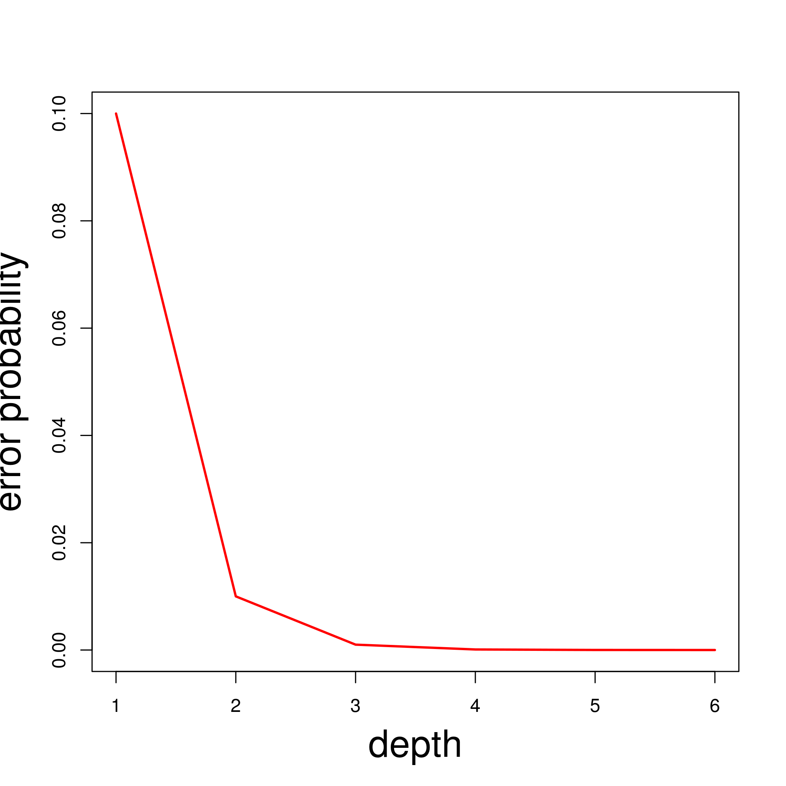

<!-- adding bold and italic options -->
<style>
em {
  font-style: italic
}
strong {
  font-weight: bold;
}
</style>

## In this lecture...

  >- Probability
  >- Hypotheses
  >- Chi-squared test of frequencies
  >- Chi-squared test of independence

--- .segue .dark 

## How likely is an event to occur?

--- .class #id

## Probability

- A numerical description of how likely an event is to occur
- Typically presented as a number between 0 to 1
- Or as a percentage

**Different interpretations**

- *Frequentist*, the observed frequency if the experiment was repeated indefinitely
- *Subjectivist*, the degree of belief in a system

--- .class #id

## Mathematical features of probability

For a fair dice, the probability of rolling each number is 0.167


- **We can calculate the probability of a series, or sequence, of events by multiplying their probabilities**
- probability of rolling 6 twice = 0.167 x 0.167 = 0.0278
- **The probability of all events sum to 1**
- 0.167 + 0.167 + 0.167 + 0.167 + 0.167 + 0.167 = 1

--- &twocol

## Examples: DNA sequencing error

- Illumina sequencing platforms have an error rate of 1%
- So every sequenced nucleotide has an error probability of 0.01
- Probability of being correct is 0.99

*** =left

`AGTCTGGTACCG`

`AGTCTGGTACCG`

- Error probability at 2x coverage 0.01 * 0.01 = 0.0001

*** =right


--- &twocol

## Examples: DNA sequencing error

- Oxford nanopore platforms have an error rate of 10%
- So every sequenced nucleotide has an error probability of 0.1
- Probability of being correct is 0.9

*** =left

`AGTCTGGTACCG`

`AGTCTGGTACCG`

- Error probability at 2x coverage 0.1 * 0.1 = 0.01

*** =right


--- &twocol bg:white

## Examples: DNA sequencing error

- Oxford nanopore platforms have an error rate of 10%
- So every sequenced nucleotide has an error probability of 0.1
- Probability of being correct is 0.9

*** =left

`AGTCTGGTACCG`

`AGTCTGGTACCG`

- Error probability at 2x coverage 0.1 * 0.1 = 0.01

*** =right



--- &twocol bg:white

## Genotype frequencies

- In a population, we can calculated the probability of observing genotypes at a diploid locus based on the allele frequencies 
- (assuming random mating and no selection)

*** =left

- Frequency A = 0.5
- Frequency B = 0.5

`Prob homA = 0.25`

`Prob het = 0.25 + 0.25 = 0.5`

`Prob homB = 0.25`

*** =right


--- .segue .dark 

## Probability provides the basis for a question

--- .class bg:white

## In science we call our questions hypotheses

- A `hypothesis` (plural `hypotheses`) is a proposed explanation of something
- It must be **testable**
- That means, we can predict different observations if the hypothesis is true or false


--- .class #id

## We generally split the question into two:
- `Null hypothesis`: there is no effect
- `Alternate hypothesis`: there is an effect
- We try to reject or disprove the null hypothesis
- Then we can accept the alternate hypothesis


--- .class #id

## Example: human sex ratio

### You hypothesise that the human sex ratio at birth may be slighly different to the 50:50 ratio generally assumed

- Null hypothesis: 50% males, 50% females
- Alternate hypothesis: % male and % female are different

>- The observed percentage turns out to be around 52.5%
>- You reject the null hypothesis and accept the alternate hypothesis
>- If 50% were observed, then you would fail to reject the null hypothesis

--- .segue .dark 

## Test of frequencies

--- .class #id

## Test of frequencies

- Probability theory allows us to predict the frequencies of events based on a particular prediction
- E.g. Probability of rolling each number on a dice is equal
- We can carry out an experiment to test our prediction

### Problem

- At small sample sizes, the frequencies will vary due to sampling effect
- We need a way to "see through" this sampling noise
- **What is the probability of observing frequencies X if the true frequencies are Y**

--- .class #id

## Chi-squared test of frequencies

- Tells us if the observed frequencies form a sample are consistent with our (pre-defined) expected frequencies
- Population example, allele frequencies A = 0.5, B = 0.5
- Null hypothesis: random mating and no selection

genotype|observed|expected
--------|--------|--------
homA|22|25
het|53|50
homB|25|25


```
## 
## 	Chi-squared test for given probabilities
## 
## data:  obs
## X-squared = 0.54, df = 2, p-value = 0.7634
```

--- .class #id

## Chi-squared test of frequencies

- Tells us if the observed frequencies form a sample are consistent with our (pre-defined) expected frequencies
- Population example, allele frequencies A = 0.5, B = 0.5
- Null hypothesis: random mating and no selection

genotype|observed|expected
--------|--------|--------
homA|40|25
het|20|50
homB|40|25


```
## 
## 	Chi-squared test for given probabilities
## 
## data:  obs
## X-squared = 36, df = 2, p-value = 1.523e-08
```

--- .class #id

## Chi-squared test: uses and assumptions

- Tells us if the observed frequencies differ from the expected
- Useful in situations where we can predict frequencies under a particular set or rules or processes

### Assumptions

- Counts of categorical variables
- Categories are mutually exclusive
- each subject = 1 count
- The data are collected at random
- The *expected* counts should be 5 or more in 80% of cases
- No case should have an expected count < 1
- This helps determine the minimum sample size

--- .segue .dark 

## What if we don't know the expected frequencies?

--- .class #id

## What if we don't know the expected frequencies?

- Example - in a drug trial with test and control (placebo) groups, we don't know the expected frequencies
- We can display these results in a **Contingency table**


|        | negative| positive|
|:-------|--------:|--------:|
|test    |       50|      450|
|control |      100|      400|

- We can use a **Chi-squared test of differences** to see if the frequencies are different


```
## 
## 	Pearson's Chi-squared test with Yates' continuity correction
## 
## data:  table(trials_data$group, trials_data$outcome)
## X-squared = 17.19, df = 1, p-value = 3.381e-05
```

--- .class #id

## In this lecture...

  - Probability
  - Hypotheses
  - Chi-squared test of frequencies
  - Chi-squared test of independence

--- &thankyou

## Next time

**Non-Parametric Tests for Differences**
